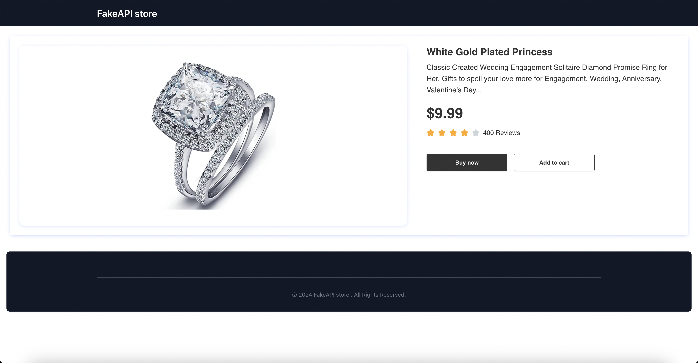

# E-Commerce Store with React, Tailwind & FakeStore

The FakeStore is an E-commerce store built in React using the FakeStore API. The FakeStore has all the essential features of a real-time E-commerce store. The user can browse products, filter products based on categories, search for products using a search bar, add new products, and delete existing ones.

## Table of contents

- [Overview](#overview)
  - [Features](#features)
  - [Screenshot](#screenshot)
  - [Links](#links)
  - [Built with](#built-with)
- [Author](#author)

## Overview

### Features

Users can:

- See all Products
- See products by categories
- Search Product
- Add new Products
- Update Existing Products
- Delete Products
- See product detail
- View Optimal layout based on their device

### Screenshot

### Links

- Live Site URL: [https://fake-api-store-using-reactjs-tailwindcss.vercel.app/
  ](https://fake-api-store-using-reactjs-tailwindcss.vercel.app/)
- Video Tutorial: [Youtube link](https://youtu.be/6noM056stoE)

### Built with

  

## Author

- Youtube - [Ahmad Faraz CodeCraft](https://www.youtube.com/@farazCodeCraft)
- Dev.to - [@ahmadfarazcrypto](https://dev.to/ahmadfarazcrypto)